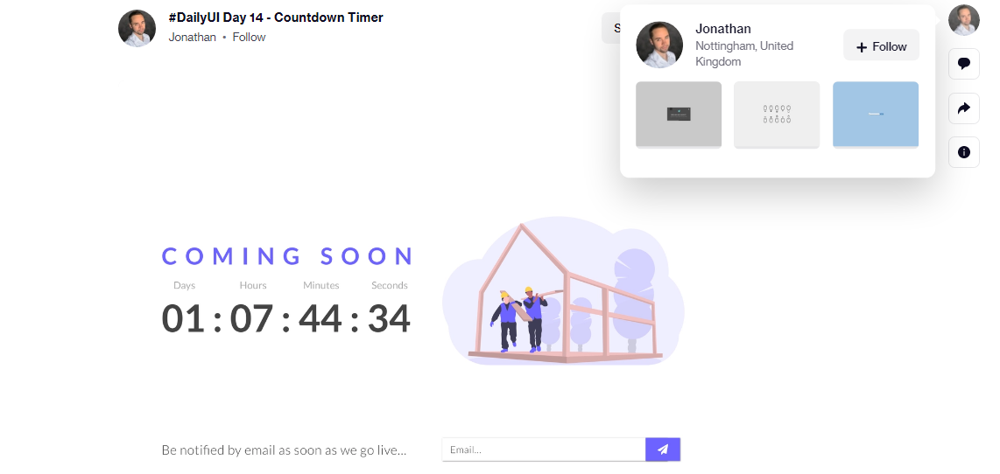
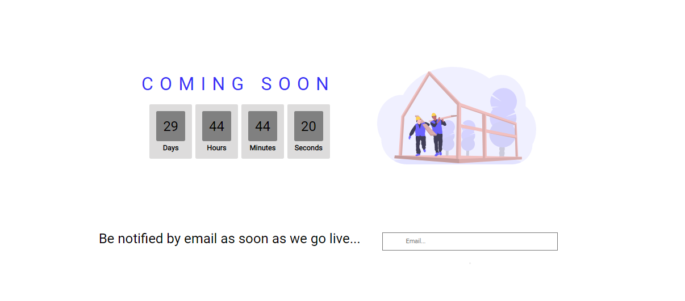

# JavaScript Countdown Timer

A simple JavaScript countdown clock without any dependencies that uses the setInterval method to calls a function at specific times.

This projects was first see as a design shot on dribble by 

# Completed Screen

Here's the completed project

